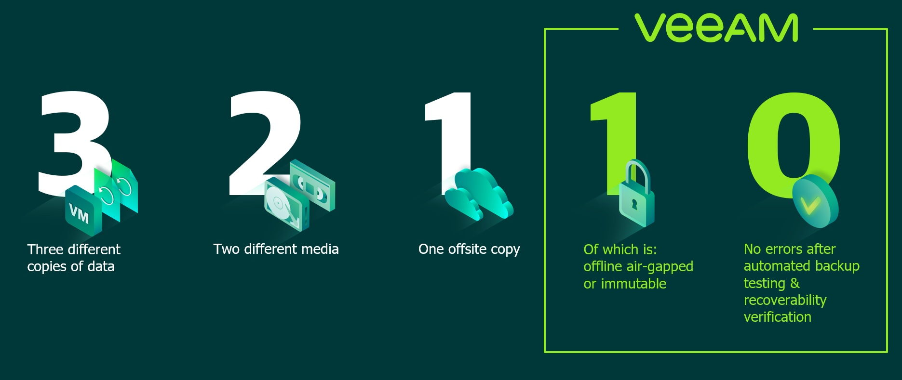
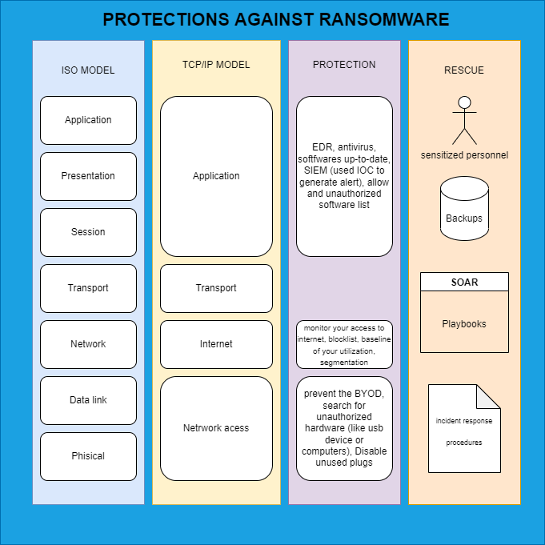

- [Purpose](#purpose)
- [Inventory](#inventory)
  - [What should your inventory contain and why?](#what-should-your-inventory-contain-and-why)
  - [End of life equipment](#end-of-life-equipment)
  - [Secure boot](#secure-boot)
  - [Softwares list](#softwares-list)
    - [Allowed softwares](#allowed-softwares)
    - [Forbidden softwares](#forbidden-softwares)
  - [Hardening](#hardening)
  - [Antivirus / EDR](#antivirus--edr)
- [Backups](#backups)
  - [Rule 3-2-1](#rule-3-2-1)
    - [Explanations](#explanations)
      - [Three copies](#three-copies)
      - [Two different media](#two-different-media)
      - [One offsite external backup](#one-offsite-external-backup)
  - [Rule 3-2-1-1-0](#rule-3-2-1-1-0)
    - [Explanations](#explanations-1)
      - [One offline copy](#one-offline-copy)
      - [Zero errors during the restoration](#zero-errors-during-the-restoration)
  - [Minimum storage time](#minimum-storage-time)
  - [Backup tests](#backup-tests)
- [Phishing prevention](#phishing-prevention)
  - [Antispam and email protection](#antispam-and-email-protection)
  - [Analysis procedure](#analysis-procedure)
  - [Phishing drill](#phishing-drill)
- [Internet browsing protection](#internet-browsing-protection)
  - [DNS filtering](#dns-filtering)
  - [Centralized management of browsers](#centralized-management-of-browsers)
- [Patching](#patching)
  - [SLA for patching according to CVE](#sla-for-patching-according-to-cve)
- [Access control](#access-control)
  - [Password & MFA](#password--mfa)
  - [Zero trust](#zero-trust)
  - [Audit of account usage](#audit-of-account-usage)
- [Risk analysis](#risk-analysis)
  - [Return to service](#return-to-service)
  - [Review of risks on connected networks](#review-of-risks-on-connected-networks)
- [Network](#network)
  - [PCAP](#pcap)
  - [Segmentation](#segmentation)
  - [Review of blocked flows](#review-of-blocked-flows)
  - [Alert outside of standard use](#alert-outside-of-standard-use)
- [Incident Response](#incident-response)
- [Summary statement](#summary-statement)
- [Read more](#read-more)

# Purpose
We will look at the basic questions to help you to evaluate your level of protection against cyber disaster on your infrastructure.
# Inventory
Protecting your infrastructure requires knowing what devices are connected to your network, what applications are being used, who has access to them and what security measures are in place.
## What should your inventory contain and why?
As with all IT security issues, you will need a complete inventory.
This inventory should include at least the following information: 
* the hardware of each workstation and server
* the software installed with the exact version
* the date of the last report
## End of life equipment
Thanks to your inventory, you have been able to isolate all the equipment (hardware and software) at the end of their support.

Equipment that is no longer maintained is equipment that will no longer receive security patches.

It is then necessary to exclude from your network all the equipment that cannot be maintained.
In case of extreme necessity, a risk acceptance by a CISO must be performed and traced in your inventory.

This analysis must be reviewed at regular intervals, ideally at each new vulnerability discovered.
## Secure boot
Secure boot must be enabled on all your compatible devices.
This feature ensures that the computer boots using only manufacturer approved software.

This is a feature that has been available for 10 years, so it is unlikely that a problem will occur if you have standard usage.
## Softwares list
In order to limit the attack surface, it is important that your company has a strict policy regarding authorized and unauthorized software.
### Allowed softwares
To do so, the use of GPO or Intune allows you to provide your users with a quickly available software library without the need for administrative rights to its stations.

This avoids that your users have to download the installation programs themselves and therefore limits the risk of downloading a malicious program.
### Forbidden softwares
In the same way, whether via Intune or AppLocker, it is necessary to block software identified as forbidden (either because you do not legitimize the application or because its version is subject to a CVE that is dangerous for you).
Each use of a prohibited application must be reported to your company's IT team.
## Hardening
Does your company rely on proven hardening guides to define the configuration of your devices?
These hardening guidelines can cover different levels such as: 
* station handover procedures with prerequisite checklist,
* audit of the secure configuration of the devices
* alert in case of configuration modification.

This hardening can be done in several ways, such as Ansible, GPO or Intune.
## Antivirus / EDR
Make sure that your company deploys an antivirus, or even an EDR on the entire fleet, starting with the devices that are critical to your business.

Do not forget to set up a follow-up of the generated alerts.
# Backups
Backups are not a mechanism for fighting ransomware per se, but they are your last line of defense.
A non-operational backup system following an attack could jeopardize the survival of your business.
## Rule 3-2-1
As a basic rule and the minimum expected for an infrastructure, the 3-2-1 rule states that you must:
* have at least three copies of your data
* store on two different media,
* one of which must be an offsite external backup.
### Explanations
#### Three copies
The principle is to have your data on the server and two backups. This is to avoid that a failure makes your backups inoperative.
#### Two different media
Here, two media should not be understood as necessarily two different physical formats (hard disk and LTO tape) but as having one's backup on two different and unrelated points. Thus, it is possible to have two copies of the backup on hard disks if the two are not stored in the same datacenter, not linked via the same software RAID, etc.
#### One offsite external backup
The idea behind this request is to have a backup stored outside your building that contains the main data to protect against risks such as fire.
## Rule 3-2-1-1-0
This rule is to be applied at least on the critical resources of your company. Identical to the 3-2-1 rule, it adds two conditions:
* 1 offline copy,
* 0 errors during the restoration.

### Explanations
#### One offline copy
This is about having a backup that is not connected to your network and any IT infrastructure.
The goal is to avoid that if an attacker has compromised your network, he can intervene on this backup.
#### Zero errors during the restoration
This point seems logical, but it is advisable to regularly test the backups made and check that they can be restored without errors.
It would be a shame if once restored, it is discovered that a file on the database server is actually damaged.
## Minimum storage time
It is important that the backups allow to restore at least 30 days old data.
Why 30 days? Because the average time between the intrusion in the park and the detection by the company is about this time.
## Backup tests
Now that your data is backed up according to best practices, it is important to ensure that your test restores are tracked and that each server is restored at least once a year.

**If you use Veeam, check out Sure Backup.**
# Phishing prevention
Phishing attacks represent one of the biggest initial attack vectors along with the exploitation of vulnerabilities on your online servers.
## Antispam and email protection
Do all emails received by your employees pass through a spam filter and antivirus? Do the attachments also?
Is this configuration reviewed and kept up to date with new threats?
## Analysis procedure
When one of your employees receives an email and has a doubt, he should have the possibility to contact someone to perform an analysis of the email.
## Phishing drill
Although I am not in favor of this type of exercise, as it is often experienced as an attack on the staff, it may be worthwhile to conduct a test to ensure that your staff is properly aware.
# Internet browsing protection
Filter connections to unauthorized websites, suspicious domain names and known malicious domain names.
## DNS filtering
Block dangerous sites and filter unwanted content through your firewalls.
In addition to "unprofessional" categories like porn, there is one category that is rarely blocked, URL shorteners. This service is massively used, especially for phishing.

Once the blocking is configured, it is necessary to control the blocked sites that your employees have tried to reach.
## Centralized management of browsers
Updating browser security settings can make it harder for malware to install. 
For example, to reduce the ability to install plug-ins or to disable the automatic execution of certain types of content.
# Patching
Deploy patches to your software and firmware as quickly as possible. 
Enable automatic updates whenever possible. 

Somes possibiliies : WSUS, [PDQ Deploy](https://www.pdq.com/pdq-deploy/), [WAPT](https://www.tranquil.it/gerer-parc-informatique/decouvrir-wapt/), etc.
## SLA for patching according to CVE
Have you set up a maximum update time for your workstations/servers/software?
If yes, do you take into account criteria such as the CVSS score, the fact that the server to be patched is on the Internet or not, that the CVE is known to be exploited ?
# Access control
Implement policies, processes and technologies that ensure that only authorized users are granted the minimum privileges necessary.
There is no magic bullet here that works for everyone, you need to adapt, take it step by step.
## Password & MFA
The lowest level of protection is the implementation of a password policy within your environment.
In the case of a Windows environment, this policy should be set in the "Default Domain Policy" to ensure that it applies to all computers.

Whenever possible, use stronger mechanisms than password authentication, such as biometrics, one-time passwords and application tokens. Multi-factor authentication, via SMS or application authenticator, is highly recommended, starting with privileged users and extending to all users.
## Zero trust
Identify and disable unused accounts, eliminate shared accounts, remove unnecessary privileges and enforce strong password policies.
## Audit of account usage
Monitor and analyze user activity for anomalous behavior such as access attempts outside of normal business hours or from unusual locations.

Your fleet should not contain more than 15% of accounts with the "domain administrator" privilege.
# Risk analysis
Use risk assessments to prioritize the allocation of resources and investments.
## Return to service
Has your company conducted a study to define which resources should be recovered first? 
This analysis can also be used to estimate the impact of disruptions and identify allowable downtime.
## Review of risks on connected networks
Every connection to your company is a risk to it.
Whether it's within an entity of your company or a partner.
Keep in mind that each of these parties may not have the same security requirements as you.

Are your partners committed to the same level of security as you, do you know how quickly they update when a vulnerability is disclosed? Are they committed to not using default certificates on VPNs? If they use online solutions, are you sure that their configuration is in line with your security needs?
# Network
Monitor your organization's incoming and outgoing Internet traffic.
## PCAP
Use the SPAN ports of your network equipment to capture your network activities.
This capture will allow you to detect abnormal behavior (increased use of a protocol, abnormal destination addresses, etc.) as well as to perform a post-mortem in case of compromise.
## Segmentation
Segmentation divides a computer network into smaller parts. Network segmentation improves network performance and security by reducing the attack surface and limiting the range of an attack.

The use of VLAN, PVLAN allows you to separate your different networks.
Are the administration interfaces of your network equipment available from Jeanne's accounting station? Is the remote office service only available on a dedicated network?
## Review of blocked flows
Now that your corporate network is segmented, and flows are prohibited, the next step is to set up a review to identify the origin of the requests that get blocked with your new policy.
It could be a compromised workstation, an application that went under your radar in the inventory, etc.
## Alert outside of standard use
Once all this is in place, you can generate alerts in case of abnormal network usage.
Besides the security gain, these alerts could allow you to identify weak points in your organization, for example, when your backup tools saturate the network.
# Incident Response
Make sure you have clear processes in place and known to your staff regarding the escalation of major incidents.

A major incident that is quickly escalated to the experts can allow you to mitigate the impact of a cyberattack.
# Summary statement

# Read more

* [Surebackup VEEAM](https://helpcenter.veeam.com/docs/backup/vsphere/surebackup_recovery_verification.html?ver=110)
* [Zero Trust](https://twitter.com/heyValdemar/status/1548046629176877058)
* [CIS Hardening](https://www.cisecurity.org/cis-benchmarks/)
* [NIST Hardening](https://csrc.nist.gov/Projects/National-Checklist-Program)