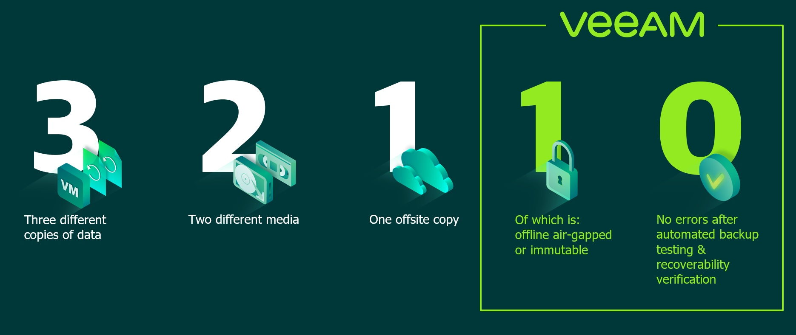
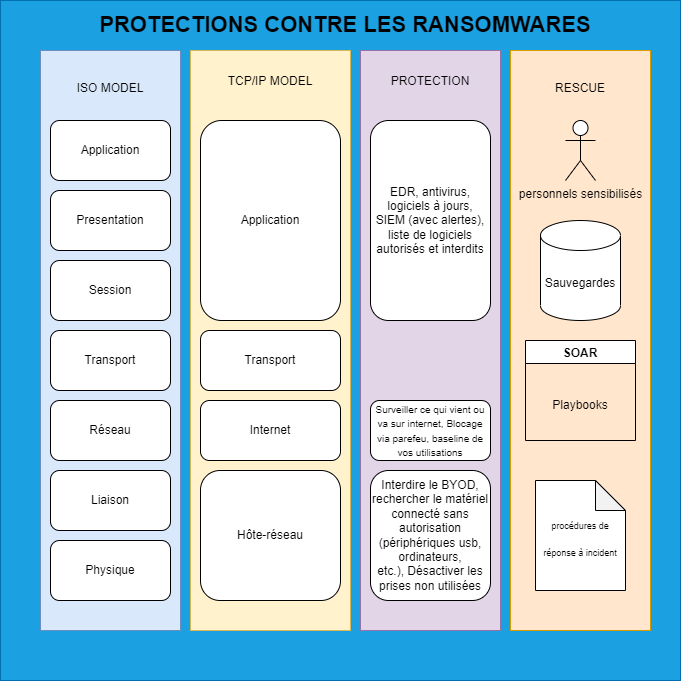

- [Objectif](#objectif)
- [Gestion du parc](#gestion-du-parc)
  - [Que dois contenir votre inventaire et pourquoi ?](#que-dois-contenir-votre-inventaire-et-pourquoi-)
  - [Équipements en fin de vie](#équipements-en-fin-de-vie)
  - [Secure boot](#secure-boot)
  - [Liste de logiciels](#liste-de-logiciels)
    - [Logiciels autorisés](#logiciels-autorisés)
    - [Logiciels interdits](#logiciels-interdits)
  - [Durcissement](#durcissement)
  - [Antivirus / EDR](#antivirus--edr)
- [Sauvegardes](#sauvegardes)
  - [Règle 3-2-1](#règle-3-2-1)
    - [Explications](#explications)
      - [Trois copies](#trois-copies)
      - [Deux supports](#deux-supports)
      - [Une sauvegarde hors site](#une-sauvegarde-hors-site)
  - [Règle 3-2-1-1-0](#règle-3-2-1-1-0)
    - [Explications](#explications-1)
      - [Une copie hors ligne](#une-copie-hors-ligne)
      - [Zéro erreur lors de la restauration](#zéro-erreur-lors-de-la-restauration)
  - [Durée minimale de conservation](#durée-minimale-de-conservation)
  - [Tests des sauvegardes](#tests-des-sauvegardes)
- [Protection phishing](#protection-phishing)
  - [Antispam et protection des mails](#antispam-et-protection-des-mails)
  - [Procédure d'analyse](#procédure-danalyse)
  - [Exercice de phishing](#exercice-de-phishing)
- [Protection navigation internet](#protection-navigation-internet)
  - [Filtrage DNS](#filtrage-dns)
  - [Gestion centralisée des navigateurs](#gestion-centralisée-des-navigateurs)
- [Patching](#patching)
  - [SLA pour patching suivant score CVSS](#sla-pour-patching-suivant-score-cvss)
- [Gestion des accès](#gestion-des-accès)
  - [Mot de passe et MFA](#mot-de-passe-et-mfa)
  - [Audit des comptes (zero privileges)](#audit-des-comptes-zero-privileges)
  - [Audit de l'utilisation des comptes](#audit-de-lutilisation-des-comptes)
- [Analyse de risques](#analyse-de-risques)
  - [Reprise de service](#reprise-de-service)
  - [Revue des risques sur réseau connectés au votre](#revue-des-risques-sur-réseau-connectés-au-votre)
- [Réseau](#réseau)
  - [Export pcap](#export-pcap)
  - [Segmentation](#segmentation)
  - [Revue des flux bloqués](#revue-des-flux-bloqués)
  - [Alerte hors utilisation standard](#alerte-hors-utilisation-standard)
- [Réponse à incident](#réponse-à-incident)
- [Récapitulatif](#récapitulatif)
- [En savoir plus](#en-savoir-plus)

# Objectif
Nous allons voir les questions de base pour vous aider à évaluer votre niveau de résilience en cas de désastre sur vos SI.
# Gestion du parc
La protection de votre infrastructure nécessite de savoir quels appareils sont connectés à votre réseau, quelles applications sont utilisées, qui y a accès et les mesures de sécurité en place.
## Que dois contenir votre inventaire et pourquoi ?
Comme pour tout ce qui concerne la sécurité du parc informatique, vous aurez besoin d'un inventaire complet.
Cet inventaire doit comprendre à minima les informations suivantes : 
* le hardware de chaque poste et serveur
* les logiciels installés avec la version exacte
* la date de dernière remontée dans votre inventaire
## Équipements en fin de vie
Grâce à votre inventaire, vous avez pu isoler tous les équipements (matériel et logiciel) en fin de support.
Un équipement qui n'est plus maintenu est un équipement qui ne recevra plus les correctifs de sécurité.

Il convient alors d'exclure du parc tous les équipements sans maintenance possible.
En cas d'extrême nécessité, une acceptation de risque par une personne habilitée doit être réalisée et tracée dans votre inventaire.

Cette analyse doit être revue à intervalle régulier, idéalement à chaque nouvelle vulnérabilité découverte.
## Secure boot
Le secure boot doit être activé sur tous vos périphériques compatibles.
Cette fonctionnalité permet de s'assurer que le poste démarre en utilisant uniquement les logiciels approuvés par le constructeur.

Il s'agit d'une fonctionnalité disponible depuis 10 ans, il est donc peu probable qu'un problème survienne si vous avez une utilisation standard.

_Méfiance lors des scans antivirus de cette zone, c'est un nid à faux-positifs_
## Liste de logiciels
Afin de limiter la surface d'attaque, il est important que votre entreprise dispose d'une politique stricte concernant les logiciels autorisés ou non.
### Logiciels autorisés
Pour se faire, l'utilisation de GPO ou de Intune permet de mettre à disposition de vos usagers une logithèque disponible rapidement sans avoir besoin de droits d'administration de sa station.

Cela évite que vos usagers n'aient à télécharger eux-mêmes les programmes d'installations et donc limite le risque de télécharger un programme malveillant.
### Logiciels interdits
De la même manière, que ce soit via Intune ou via AppLocker, il est nécessaire de bloquer les logiciels identifiés comme interdits (que ce soit parce que vous ne légitimez pas l'application soit parce que sa version est soumise à 1 CVE dangereuse pour vous).
Chaque utilisation d'un applicatif interdit doit faire l'objet d'une alerte auprès des équipes informatiques de votre entreprise.
## Durcissement
Votre entreprise s'appuie-t-elle sur des guides de durcissement éprouvés afin de définir la configuration de vos périphériques ?
Ces durcissements peuvent couvrir différents niveaux tels que : 
* les procédures de remises de postes avec liste de contrôle des prérequis,
* audit de la configuration sécurisée des périphériques,
* alerte en cas de modification de la configuration.

Ce durcissement peut être opéré de plusieurs manières, que ce soit Ansible, GPO, Intune.
## Antivirus / EDR
Assurez-vous que votre entreprise déploie un antivirus, voire un EDR sur l'ensemble du parc en commençant par les périphériques critique pour votre activité.

N'oubliez pas de mettre en place un suivi des alertes générées.
# Sauvegardes
Les sauvegardes ne sont pas un mécanisme de lutte contre les pannes majeures à proprement parler, en revanche c'est votre dernière ligne de défense.
Un système de sauvegarde non opérationnel à la suite d'un désastre sur votre SI risque de compromettre la survie de votre entreprise.
## Règle 3-2-1
Règle de base et le minimal attendu pour une infrastructure, la règle des 3-2-1 stipule que vous devez :
* disposer de trois copies de vos données au moins,
* stocker sur deux supports différents,
* dont une sauvegarde externalisée hors site.
### Explications
#### Trois copies
Le principe est d'avoir votre donnée sur le serveur et deux sauvegardes. Ceci a pour but d'éviter qu'une panne rende inopérantes vos sauvegardes.
#### Deux supports
Ici, il ne faut pas comprendre deux supports comme forcément deux formats physiques différents (disque dur et bande LTO), mais comme avoir sa sauvegarde sur deux points différents et non liés. Ainsi, il est possible d'avoir deux copies de la sauvegarde sur disques durs si les deux ne sont pas stockés dans le même datacenter, non liés via le même RAID logiciel, etc.
#### Une sauvegarde hors site
L'idée derrière cette requête est d'avoir une sauvegarde stockée en dehors de votre bâtiment qui contient la donnée principale afin de se prémunir des risques telle que les incendies.
## Règle 3-2-1-1-0
Cette règle est à appliquer a minima sur les ressources critiques de votre entreprise. Identique à la règle du 3-2-1, elle ajoute deux conditions :
* 1 copie hors ligne,
* 0 erreur lors de la restauration.

### Explications
#### Une copie hors ligne
Il est ici question d'avoir une sauvegarde qui n'est pas reliée à votre réseau et de toute infrastructure informatique dans l'idéal.
Le but est d'éviter que si un attaquant a compromis votre réseau, il puisse intervenir sur cette sauvegarde.
#### Zéro erreur lors de la restauration
Ce point semble logique, mais il convient de tester régulièrement les sauvegardes réalisées et de vérifier qu'elle soit restaurable sans erreur.
Il sera dommageable qu'une fois restauré, on découvre qu'un fichier du serveur de base de données est enfaîte endommager.
## Durée minimale de conservation
Il est important que les sauvegardes permettent de restaurer à minima des données remontant à 30 jours.
Pourquoi 30 jours ? Parce que la durée moyenne entre l'intrusion dans le parc et la détection par l'entreprise est d'environ ce délai.
## Tests des sauvegardes
Maintenant que vos données sont sauvegardées suivant les bonnes pratiques, il convient de s'assurer que vos tests de restaurations sont tracés et que chaque serveur soit restauré au moins une fois par an.

**Si vous utilisez Veeam, regardez du côté de Sure Backup.**

# Protection phishing
Les attaques par phishing représentent un des plus gros vecteurs initiaux d'attaque avec l'exploitation de vulnérabilité sur vos serveurs en ligne.
## Antispam et protection des mails
Est-ce que les mails reçus par vos employés passent tous dans un filtre antispam et antivirus ? Les PJ aussi ?
Est-ce que cette configuration est revue et maintenue à jour pour tenir compte des nouvelles menaces ?
## Procédure d'analyse
Lorsqu'un de vos employés reçoit un mail et qu'il a un doute, il doit avoir la possibilité de contacter quelqu'un pour réaliser une analyse du mail.

Si besoin consulter la [procédure suivante](https://github.com/Blue-Atom-10101/-PROCESS-Investigate-Phishing)
## Exercice de phishing
Bien que je ne sois pas pour, ce type d'exercice étant souvent vécu comme une attaque contre le personnel, il peut être intéressant de réaliser un test afin de vous assurer que votre personnel est correctement sensibilisé.
# Protection navigation internet
Filtrez les connexions aux sites Web non autorisés, aux noms de domaines suspects et aux noms de domaines malveillants connus.
## Filtrage DNS
Bloquer les sites dangereux et filtrer les contenus indésirables via vos pare-feu.
Outre les catégories "non-professionnelles" comme le porno, il y a une catégorie rarement bloquée, les raccourcissent d'URL. Ce service est massivement utilisé, notamment pour du phishing.

Une fois le blocage configuré, il est nécessaire de contrôler les sites bloqués que vos employés ont tenté de joindre.
## Gestion centralisée des navigateurs
La mise à jour des paramètres de sécurité des navigateurs peut compliquer l'installation des logiciels malveillants. 
Par exemple, réduire la capacité d'installation de plug-in ou encore pour désactiver l'exécution automatique de certains types de contenu.
# Patching
Déployez les correctifs de vos logiciels et firmwares aussi rapidement que possible. 
Activez les mises à jour automatiques dans la mesure du possible. 

Plusieurs solutions existent: WSUS, [PDQ Deploy](https://www.pdq.com/pdq-deploy/), [WAPT](https://www.tranquil.it/gerer-parc-informatique/decouvrir-wapt/), etc.
## SLA pour patching suivant score CVSS
Avez-vous mis en place un temps maximal de mise à jour de vos postes/serveurs/logiciels ?
Si oui, tenez-vous compte des critères comme le score CVSS, le fait que le serveur à patcher soit en frontal sur internet ou non, que la faille soit connue pour être exploitée ?
# Gestion des accès
Mettez en œuvre des politiques, des processus et des technologies qui garantissent que seuls les utilisateurs autorisés se voient accorder les privilèges minimaux nécessaires.
Ici, aucune solution miracle qui fonctionne pour tous, il convient de vous adapter, d'y aller étape par étape.
## Mot de passe et MFA
Le niveau le plus bas de protection est la mise en place d'une politique de mot de passe au sein de votre environnement.
Dans le cas d'un environnement Windows, cette règle doit être positionnée dans la "Default Domain Policy" pour s'assurer qu'elle s'applique sur tous les postes.

Lorsque possible, utilisez des mécanismes plus robustes que l'authentification par mot de passe, tels que la  biométrie, les mots de passe à usage unique et les jetons pour les applications. L'authentification multifacteurs, via SMS ou application authentificator, est fortement recommandée en commençant par les utilisateurs privilégiés, puis en l'étendant à tous les utilisateurs.
## Audit des comptes (zero privileges)
Identifiez et désactivez les comptes inutilisés, éliminez les comptes partagés, supprimez les privilèges inutiles et appliquez des politiques de mots de passe solides.
## Audit de l'utilisation des comptes
Surveillez et analysez les activités des utilisateurs pour détecter les comportements anormaux tels que les tentatives d'accès en dehors des heures normales de travail ou à partir d'emplacements inhabituels.

Votre parc ne doit pas contenir plus de 15% de comptes avec le privilège "administrateurs du domaine".
# Analyse de risques
Utilisez les évaluations des risques pour hiérarchiser l'allocation des moyens et investissements.
## Reprise de service
Votre entreprise a-t-elle réalisé une étude afin de définir les ressources qui doivent être récupérées en premier ? 
Cette analyse permet également d'estimer l'impact des perturbations et d'identifier les temps d'indisponibilité autorisés.
## Revue des risques sur réseau connectés au votre
Chaque interconnexion à votre entreprise est un risque.
Que ce soit au sein d'une entité de votre entreprise ou un partenaire.
N'oubliez pas que chacune de ces parties n'a peut-être pas les mêmes exigences en termes de sécurité que vous.

Vos partenaires sont-ils engagés sur le même niveau de sécurité que vous, savez-vous leur délai de mise à jour lorsqu'une vulnérabilité est divulguée ? S'est-il engagé à ne pas utiliser les certificats par défaut sur les VPN ? S'ils utilisent des solutions en lignes, êtes-vous sûr que sa configuration est conforme avec vos besoins de sécurité ? etc.
# Réseau
Surveillez le trafic Internet entrant et sortant de votre organisation.
## Export pcap
Utiliser les ports SPAN de vos équipements réseau pour réaliser des captures de vos activités réseau.
Cette capture permettra aussi bien de détecter des comportements anormaux (hausse d'utilisation d'un protocole, adresses de destinations anormales, etc.) que d'effectuer un post-mortem en cas de compromission.
## Segmentation
La segmentation divise un réseau informatique en parties plus petites. La segmentation d'un réseau améliore les performances et la sécurité du réseau en réduisant la surface d'attaque et en limitant la portée d'une attaque.

L'utilisation de VLAN, PVLAN, permet de séparer vos différents réseaux.
Les interfaces d'administration de vos équipements réseau sont-elles disponibles depuis le poste de Jeanne de la comptabilité ? Le service bureau à distance n'est-il disponible que sur un réseau dédié ?
## Revue des flux bloqués
Maintenant que votre réseau d'entreprise est segmenté, que des flux sont interdits, il reste à mettre en place une revue pour identifier l'origine des requêtes qui se retrouvent bloquées avec votre nouvelle politique.
Il pourrait s'agir d'un poste compromis, d'une application passée sous votre radar dans l'inventaire, etc.
## Alerte hors utilisation standard
Une fois tout ceci mit en place, vous avez moyen de générer des alertes en cas d'utilisation anormale du réseau.
Outre le gain de sécurité, ces alertes pourraient vous permettre d'identifier les points faibles de votre organisation, par exemple lorsque vos outils de sauvegardes saturent le réseau.
# Réponse à incident
Assurez-vous d'avoir des processus clairs et connus de vos personnels concernant la remontée d'informations lors d'incidents majeurs.

Un incident majeur qui remonte rapidement aux experts peut vous permettre d'atténuer l'impact d'une cyberattaque.
# Récapitulatif

# En savoir plus

* [Incendie OVH](https://www.developpez.com/actu/313910/Incendie-OVH-plus-d-un-millier-de-sauvegardes-ne-seront-probablement-pas-recuperables-admet-OVHcloud)
* [Surebackup VEEAM](https://helpcenter.veeam.com/docs/backup/vsphere/surebackup_recovery_verification.html?ver=110)
* [Zero Trust](https://twitter.com/heyValdemar/status/1548046629176877058)
* [ANSSI guide durcissement](https://www.ssi.gouv.fr/entreprise/bonnes-pratiques/poste-de-travail-et-serveurs/)
* [How phishing attack works?](https://twitter.com/LetsDefendIO/status/1550494133743226886/photo/1)
